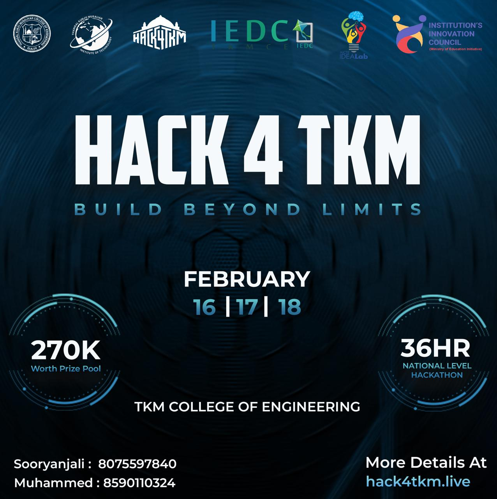

# EARTHLOOP - HACK4TKM

Welcome to EarthLoop, where sustainability meets innovation! Below, we present our project details and how it can revolutionize waste management in rural areas.

## Team Members
1. Felix Sabu (GitHub: 65lix)
2. Parvathy Gopan (GitHub: parvathy-gopan)
3. Anandhu T G (GitHub: anandhutg)
4. K P Ashil (GitHub: Ashil10)

## Link to Project
[Explore the Demo](live_link)
Please note: As our project is based on a Flutter application, we are unable to provide a live link. However, you can explore the demo to get a glimpse of our project's features and functionality.

## How it Works?
EarthLoop is a comprehensive waste management solution designed to transform rural sustainability. Our project works by providing a subscription-based waste management service that includes waste collection, segregation, recycling, and responsible disposal. Users can subscribe to EarthLoop through our mobile app and schedule waste pickups right at their doorstep. The collected recyclable materials are then sold to local vendors to contribute to the circular economy. Through data-driven insights and an incentive program, EarthLoop encourages users to reduce waste and increase recycling efforts.

Watch our demo video to see EarthLoop in action!

[Demo Video](https://www.youtube.com/watch?v=AqVM6okTqBM)

## Technologies Used
- Flutter: For mobile app development
- Canva: For design elements

## How to Configure
To set up the EarthLoop project, follow these steps:
1. Clone the repository from GitHub.
2. Install Flutter and necessary dependencies.
3. Configure API keys for any necessary integrations.
4. Run the project on your preferred platform.

## How to Run
To run EarthLoop on your device:
1. Install the EarthLoop app from the provided repository.
2. Sign up for a subscription or log in if you already have an account.
3. Schedule waste pickups and track your recycling efforts.
4. Explore the app features and contribute to rural sustainability!

## Other Links
- [Wireframe](https://www.canva.com/design/DAF89q8n-S4/V8BQMLE1Rl7btt1QI9JI_Q/edit?utm_content=DAF89q8n-S4&utm_campaign=designshare&utm_medium=link2&utm_source=sharebutton)
- [UI Design](https://drive.google.com/file/d/1aGmhUqRqRurvJSFJhFh17KuBuimiJDnf/view?usp=sharing)
- [Abstract](https://drive.google.com/file/d/1XoL2DpK4kbRzPKTbgbZrI_GYqPa9zG2h/view)
- [Presentation](https://docs.google.com/presentation/d/1oZw1RLoQ0zYpetrGoNon2r0ACUpStpZT/edit?usp=drive_link&ouid=100863133379565973271&rtpof=true&sd=true)

Feel free to explore our project and join us in our mission to create a greener, more sustainable future with EarthLoop!
